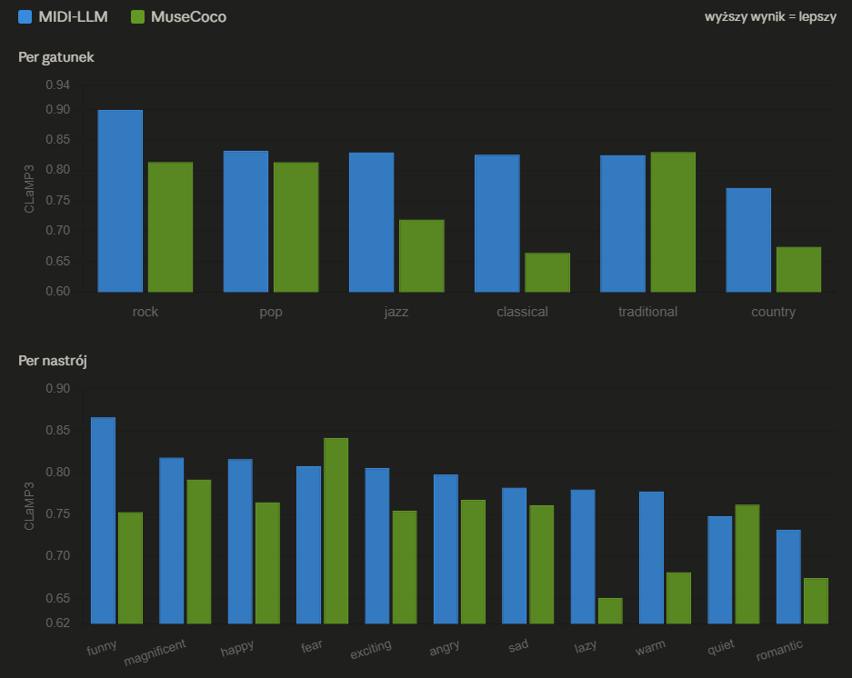
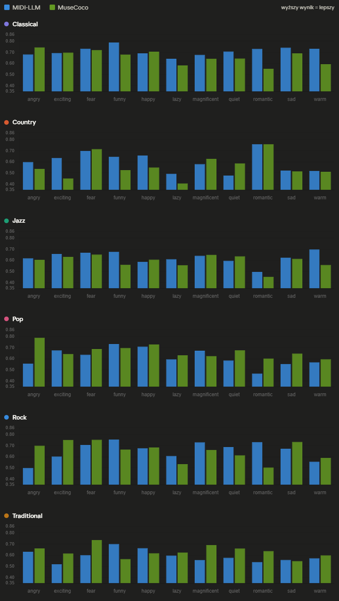
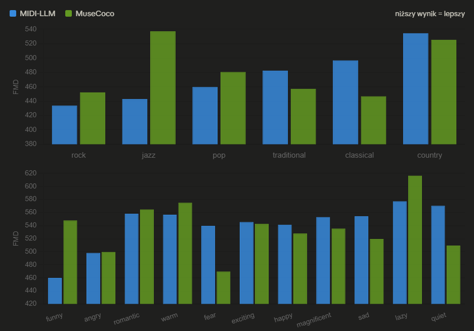
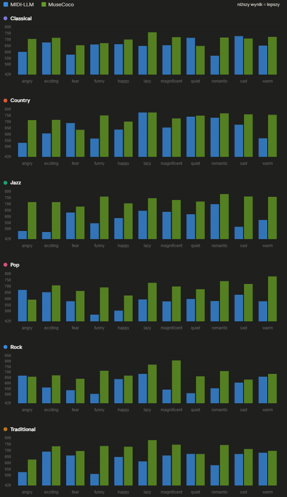

# FMD jako narzędzie ewaluacji kontrolowalności modeli generatywnych

## Design Proposal

**WIMU**  
Marcin Kowalczyk 318677  
Oskar Gorgis  
Paweł Kutyła  

---

# Opis projektu

Modele generatywne muzyki symbolicznej coraz częściej oferują kontrolę nad atrybutami wyjścia (gatunek, nastrój, instrumentacja). Projekt polega na użyciu FMD do zbadania, czy generacje warunkowane danym atrybutem rzeczywiście trafiają w rozkład odpowiedniego podzbioru referencyjnego. Dla wybranego modelu należy wygenerować próbki dla każdej klasy i porównać FMD względem odpowiednich i nieodpowiednich podzbiorów. Wyniki warto odnieść do klasyfikacji zero-shot z CLaMP 3 jako niezależnej metody weryfikacji.

---

# Analiza literatury

## Narzędzia i modele ewaluowane w projekcie

| Nazwa | Autorzy | Link | Dostępność kodu | Pre-trenowane modele | Metryki ewaluacji | Komentarz |
|-------|---------|------|-----------------|----------------------|-------------------|-----------|
| **CLaMP 3** | Wu et al. (2025) | [arXiv:2502.10362](https://arxiv.org/abs/2502.10362) | ✅ [GitHub](https://github.com/sanderwood/clamp3) | ✅ HuggingFace (`slseanwu/clamp3`) | Group Similarity (cosine), Zero-shot classification accuracy | Multimodalne (MIDI, audio, tekst, nuty) rozszerzenie CLaMP. Używany w projekcie jako główna metryka ewaluacji semantycznej. Obsługuje ekstrakcję embeddingów globalnych (`--get_global`) i lokalnych. |
| **MIDI-LLM** | Wu & Yang (2023) | [arXiv:2511.03942](https://arxiv.org/abs/2511.03942) | ✅ [GitHub](https://github.com/slSeanWU/MIDI-LLM) | ✅ HuggingFace (`slseanwu/MIDI-LLM_Llama-3.2-1B`) | Perplexity, CLaMP similarity, human evaluation | LLM warunkowany opisem tekstowym generujący pliki MIDI. Jeden z dwóch modeli ewaluowanych w projekcie. Generacja przez `generate_transformers.py` lub `generate_vllm.py`. |
| **MuseCoco** | Lu et al. (2023) | [arXiv:2306.00110](https://arxiv.org/abs/2306.00110) | ✅ [GitHub (muzic)](https://github.com/microsoft/muzic/tree/main/musecoco) | ✅ HuggingFace (`XinXuNLPer/MuseCoco_attribute2music`) | Objective: pitch entropy, groove, chord coverage; Subjective: MOS | Dwuetapowy pipeline: text-to-attribute (BERT) → attribute-to-music (Transformer). Kontrola przez atrybuty strukturalne (gatunek, nastrój, tempo, instrumentacja). Drugi model ewaluowany w projekcie. |
| **FMD (Fréchet Music Distance)** | Gui et al. (2024) | [arXiv:2412.07948](https://arxiv.org/abs/2412.07948) | ✅ [GitHub](https://github.com/jongwook/fmd) | ✅ (VGGish, OpenL3, MERT) | FMD score (analogia do FID), KID | Adaptacja FID do muzyki. Mierzy odległość Frécheta między rozkładami embeddingów zbiorów generowanego i referencyjnego. Planowane jako główna metryka dystrybucyjna w projekcie. |
| **XMIDI Dataset** | Kan et al. (2024) | [arXiv:2406.01512](https://arxiv.org/abs/2406.01512) | ✅ [GitHub](https://github.com/xmidi/xmidi) | — | Pokrycie gatunków/nastrojów, statystyki MIDI | Duży dataset MIDI z etykietami gatunku i nastroju. Używany jako zbiór referencyjny w ewaluacji CLaMP3. Pliki o strukturze `XMIDI_{vibe}_{genre}_{id}.midi`. |

## Kontekst badań – powiązane prace

| Nazwa | Autorzy | Link | Komentarz |
|-------|---------|------|-----------|
| **MusicGen** | Copet et al. (2023) | [arXiv:2306.05284](https://arxiv.org/abs/2306.05284) | Autoregresyjny model generacji muzyki audio warunkowany tekstem. Punkt odniesienia dla modeli text-to-music. |
| **MusicLM** | Agostinelli et al. (2023) | [arXiv:2301.11325](https://arxiv.org/abs/2301.11325) | Hierarchiczny model generacji audio z opisów tekstowych. Wyznaczył standard ewaluacji text-to-music. |
| **CLaMP** | Wu et al. (2023) | [arXiv:2304.11029](https://arxiv.org/abs/2304.11029) | Poprzednia wersja CLaMP (tylko MIDI i tekst). Bezpośredni poprzednik CLaMP 3 używanego w projekcie. |
| **Frechet Inception Distance (FID)** | Heusel et al. (2017) | [arXiv:1706.08500](https://arxiv.org/abs/1706.08500) | Oryginalna metryka FID dla obrazów, na której wzorowane jest FMD. |

---

# Harmonogram

| Tydzień | Postęp | Status |
|---|---|---|
| 18.03–22.03 | przygotowanie środowiska, pobranie i uruchomienie modelu MuseCoCo, wczytanie datasetu | ✅ |
| 23.03–29.03 | implementacja FMD, dodanie funkcji pomocniczych do przekształcania danych, dodanie podstawowego pipeline'u, przygotowanie prototypu | ✅ |
| 30.03–05.04 | refaktoryzacja kodu prototypu, poprawienie skalowalności pipeline'u, zapisywanie wyników do pliku | ✅ |
| 06.04–12.04 | dodanie drugiego modelu (MIDI-LLM) | ✅ |
| 13.04–19.04 | implementacja CLaMP3, obliczanie i zapis embeddingów | ✅ |
| 20.04–26.04 | pierwsze eksperymenty na większej ilości próbek, testowanie metryk porównawczych | ✅ |
| 27.04–03.05 | automatyzacja eksperymentów, napisanie testów integracyjnych | ✅ |
| 04.05–10.05 | przygotowanie wyników i statystyk, analiza wyników | ✅ |
| 11.05–17.05 | refaktoryzacja kodu projektu, poprawienie błędów | ✅ |
| 18.05–24.05 | przygotowanie raportu i prezentacji | 🔄 |

---

# Planowany zakres eksperymentów

1. **Generacja warunkowana gatunkiem i nastrojem** – wygenerowanie po 3 próbki MIDI dla każdej pary (gatunek × nastrój) dla obu modeli (MIDI-LLM: 6 gatunków × 11 nastrojów = 66 par; MuseCoco: 5 gatunków × 11 nastrojów = 55 par).

2. **Ewaluacja CLaMP3** na trzech poziomach granularności:
   - per para (gatunek × nastrój),
   - per gatunek (wszystkie nastroje razem),
   - per nastrój (wszystkie gatunki razem).

3. **Ewaluacja FMD** – porównanie rozkładów embeddingów między generowanymi próbkami a odpowiednimi podzbiorami XMIDI.

4. **Porównanie modeli** – zestawienie MIDI-LLM vs MuseCoco pod kątem wierności semantycznej (CLaMP3) i dystrybutywnej (FMD).


---

# Stack technologiczny

Głównym językiem wykorzystywanym do tworzenia systemu będzie Python. Dodatkowo planowane jest wykorzystanie narzędzia make w celu automatyzacji poszczególnych kroków w przetwarzaniu danych, zachowując przy tym wysoką czytelność i łatwość pracy w stworzonym środowisku. Eksperymenty wykonywane, a szczególnie te związane z wykorzystaniem modeli generatywnych będą częściowo przeprowadzane z wykorzystaniem narzędzia Jupyter Notebook.

---

# Funkcjonalność programu

System przygotowany przez nas będzie składał się z poniższych funkcjonalności:

- przygotowanie i filtrowanie zbioru wejściowego na podstawie atrybutów np. genre,
- generowania utworów na podstawie zadanych warunków z wykorzystaniem modeli generatywnych,
- obliczania wartości FMD między wygenerowanymi utworami a zbiorami referencyjnymi,
- uruchamianie ewaluacji przez CLaMP 3,
- otrzymanie i zebranie wyników i przedstawienie ich w postaci niewielkiego raportu lub czytelnego logu zapisanego do pliku.

Przygotowanie zbioru danych zależnie od wykorzystanego zbioru może obejmować takie kroki jak:

- filtrowanie poszczególnych gatunków (w przypadku dużych zbiorów danych rozwiązanie może dotyczyć kilku wybranych gatunków na podstawie kryteriów jak np. liczebności utworów lub naszej wiedzy na ich temat),
- przygotowanie zbiorów referencyjnych w odpowiedniej strukturze katalogów np. `data/reference`

Następnie wykorzystując modele generatywne będziemy generować utwory na podstawie warunków wejściowych. Przykładowo mogą być to parametry:

- model – w przypadku integracji kilku modeli parametr ten pozwoli na wybranie jednego z nich,
- typ atrybutu – np. `genre=jazz`,
- liczbę próbek,
- dodatkowe parametry opcjonalne np. seed w celu zapewnienia powtarzalności eksperymentów.

Kolejnym z kroków w tym pipeline jest ekstrakcja embeddingów. Wczytywane będą pliki MIDI, a następnie po wstępnym przetworzeniu obliczane będą embeddingi. Ostatnim krokiem będzie ich zapisanie do plików, co pozwoli na ograniczenie czasu niezbędnego do policzenia ich po raz kolejny, zapewniając cachowanie.

Na podstawie wygenerowanych utworów i odpowiednich podzbiorów referencyjnych obliczane będzie FMD.

Następnym etapem jest ewaluacja z wykorzystaniem CLaMP3 przyjmująca wygenerowane utwory oraz zestaw instrukcji warunkowych i zwracająca takie statystyki jak dokładność czy wykorzystując macierz pomyłek w celu lepszej wizualizacji.

Ostatecznym krokiem potoku jest zebranie danych z procesu i wizualizacja ich np. wykorzystując raport z wcześniej zdefiniowanym szablonem lub zebranie czytelnych logów w pliku.

---

## Informacja o sposobie użytkowania modeli LLM w projekcie

### Marcin Kowalczyk
Model: Gemini 3.1 Pro  
Sposób użycia: szybsze prototypowanie krótkich programów do analizy danych oraz wywołania funkcji. Debugowanie kodu oraz ograniczony research.  
Narzędzia: Nie korzystam ze środowiska ze zintegrowanym LLM'em, zazwyczaj korzystam z wersji dostępnej przez stronę internetową.

### Oskar Gorgis
Ja wykorzystuję generatywne AI do pisania mniejszych funkcji w kodzie. Używam Claude, modelu Sonnet 4.6. Poza pisaniem funkcji wykorzystuję go do planowania architektury, zadaję pytania i proszę o wytłumaczenie rozwiązań oraz podanie źródeł, z których mogę zobaczyć jak ktoś na jakimś przykładzie je implementuje.

### Paweł Kutyła
Model: DeepSeek Coder / Gemini 3.5 Flash
Sposób użycia: wykorzystuje AI głównie jako wsparcie w codziennej pracy programistycznej — do generowania fragmentów kodu, konsultowania pomysłów architektonicznych oraz szybkiego researchu technicznego. Korzysta również z modeli do wyjaśniania bardziej złożonych zagadnień i porównywania możliwych podejść do implementacji.
Narzędzia: najczęściej korzystam z modeli przez interfejs webowy, okazjonalnie wspomagając się integracjami w IDE przy pracy nad kodem.

---

## Instrukcja uruchomienia projektu

### 1. Sklonowanie repozytorium

```bash
git clone --recurse-submodules https://github.com/WIMU-2026L/WIMU
cd WIMU
```

### 2. Konfiguracja środoswiska (głównego projektu)

```bash
python -m venv .venv
```

```bash
.venv\Scripts\activate   # Windows
```
lub
```bash
source .venv\bin\activate   # Linux
```

```bash
pip install -r requirements.txt
```

### 3. Konfiguracja MIDI-LLM (submodule)

```bash
cd external/midi-llm
conda create -n midi-llm python=3.11.15
conda activate midi-llm
pip install -r requirements.txt
```

### 4. Konfiguracja MuseCoco (submodule)

```bash
cd external/muzic/musecoco
conda create -n MuseCoco python=3.8
conda activate MuseCoco
conda install pytorch=1.11.0 -c pytorch
pip install -r requirements.txt
```

W środowisku MuseCoco uruchomić
`conda install "mkl<2024"`

oraz pobrać repozytorium

`git clone https://github.com/idiap/fast-transformers`

i zainstalować je za pomocą pip'a. 

```bash
cd fast-transformers
pip install .
```

Dodatkowo, nasza maszyna powinna być wyposażona w odpowiedni kompilator gcc oraz zestaw narzędzi NVIDIA (NVIDIA toolkit) do obsługi CUDA.

Aby uruchomić generowanie próbek testowych, pobierz model z HuggingFace, umieść go w katalogu `external/muzic/musecoco/2-attribute2music_model/checkpoint/`. Opisane również w konfiguracji projektu.

### 5. Konfiguracja CLaMP3 (submodule)

#### 5.1. Utwórz i aktywuj środowisko conda

```bash
conda create -n clamp3 python=3.10.16 -y
conda activate clamp3
```

#### 5.2. Zainstaluj PyTorch z obsługą CUDA

```bash
conda install pytorch torchvision torchaudio pytorch-cuda=11.8 -c pytorch -c nvidia -y
```

#### 5.3. Zainstaluj pozostałe zależności

```bash
cd external/clamp3
pip install -r requirements.txt
```

#### 5.4. Pobierz wagi modelu

Projekt używa wersji **C2** (zoptymalizowanej pod muzykę symboliczną / MIDI). Pobierz plik `.pth` z Hugging Face:

- [Pobierz CLaMP 3 C2](https://huggingface.co/sander-wood/clamp3/blob/main/weights_clamp3_c2_h_size_768_t_model_FacebookAI_xlm-roberta-base_t_length_128_a_size_768_a_layers_12_a_length_128_s_size_768_s_layers_12_p_size_64_p_length_512.pth)

Umieść pobrany plik `.pth` w katalogu `external/clamp3/code/`.

Następnie w pliku `external/clamp3/code/config.py` ustaw linię 66 tak, aby wskazywała na wariant `c2`:

```python
# linia 66
MUSIC_ENCODER_NAME = "c2"   # zamiast "saas"
```

#### 5.5. Zaktualizuj `config.yaml`

W głównym `config.yaml` ustaw ścieżki pasujące do Twojej instalacji conda.

---
## Konfiguracja projektu

Wszystkie ścieżki i ustawienia modeli są przechowywane w **`config.yaml`** w korzeniu repozytorium. Edytuj wartości `models.midillm.python`, `models.musecoco.python`, `models.clamp3.python` i `models.clamp3.env_dir`, aby wskazywały na lokalne interpretery pythona środowisk conda. Przykład jak to zrobić został zmaieszczony na filmiku.

Potrzebne jest też umieszczenie w odpowiednch folderach zbioru danych XMIDI. Umieść w folderze `data` zbiór danych XMIDI tak aby powstał folder `XMIDI_Dataset`.

Dotatkowo trzeba umieścić wcześniej pobrane wagi modelu MuseCoco. Umieść plik o nazwie `attribute2music_clean.pt` z wagami modelu w folderze: `external/muzic/musecoco/2-attribute2music_model/checkpoints/linear_mask-1billion/`.

Dla logowania do Weights & Biases ustaw `wandb.entity` na nazwę swojego konta/zespołu i wykonaj raz `wandb login`.

---

## Uruchamianie pipeline'u (CLI)

Wszystkie komendy uruchamiane są z korzenia repozytorium używają środowiska .venv zdefiniowanego powyżej. Cały proces generowania i ewaluacji jest zintegorwany w skrypcie `src/main.py`. W celu inicjalizacji środowiska trzeba najpierw wywołać `src/main.py organize`

```bash
# Reorganizacja surowego datasetu XMIDI, tę komendę trzeba wywołać na przed uruchomieniem jakiejkolwiek funkcjonalności programu.  
python src/main.py -h
usage: wimu [-h] {organize,generate,evaluate} ...

WIMU - Music Generation Quality Evaluation Pipeline

positional arguments:
  {organize,generate,evaluate}
    organize            Reorganize raw XMIDI dataset into genre/vibe folder structure
    generate            Generate MIDI samples with a model
    evaluate            Evaluate generated MIDI with CLaMP3

options:
  -h, --help            show this help message and exit
```

Przekładowe wyowłania
```bash
# Reorganizacja surowego datasetu XMIDI
python src/main.py organize

# Generacja MIDI przez MIDI-LLM (3 pliki na prompt)
python src/main.py generate --model midillm --n_outputs 3

# Ewaluacja CLaMP3 – oba modele, wszystkie granularności
python src/main.py evaluate --model all --mode all

# Ewaluacja tylko MIDI-LLM, tylko per gatunek
python src/main.py evaluate --model midillm --mode by_genre
```

### Granularności ewaluacji CLaMP3

| Tryb | Opis | Plik wynikowy |
|------|------|---------------|
| `genre_vibe` | Każda para (gatunek, nastrój) osobno | `{model}_genre_vibe_clamp3.txt` |
| `by_genre`   | Wszystkie nastroje danego gatunku razem | `{model}_by_genre_clamp3.txt` |
| `by_vibe`    | Wszystkie gatunki danego nastroju razem | `{model}_by_vibe_clamp3.txt` |

---

## Testy automatyczne

```bash
PYTHONPATH=src python -m pytest tests/ -v
```

21 testów jednostkowych pokrywa: parsowanie JSON z promptami, reorganizację datasetu, parsowanie wyników CLaMP3 oraz kopiowanie plików MIDI.

---

## Jakość kodu

```bash
# Formatowanie
black src/ tests/

# Linting
ruff check src/ tests/
```

Oba narzędzia skonfigurowane są w `pyproject.toml` z limitem linii 100 znaków (PEP 8 z rozszerzonym limitem).

---

## Struktura projektu

```
WIMU/
├── config.yaml              # Konfiguracja ścieżek i modeli
├── pyproject.toml           # Konfiguracja black / ruff / pytest
├── src/
│   ├── main.py              # CLI (argparse)
│   ├── config.py            # Ładuje config.yaml, eksportuje stałe
│   ├── data/
│   │   ├── data_loader.py
│   │   ├── dataset_processing.py
│   │   └── midisample_class.py
│   ├── model/midillm/
│   │   ├── generator.py
│   │   └── pipeline.py
│   └── metrics/
│       ├── clamp3.py
│       ├── fmd.py
│       └── wandb_logger.py  # Logowanie wyników do W&B
├── tests/
│   ├── test_dataset_processing.py
│   ├── test_clamp3_parsing.py
│   └── test_prompts.py
├── data/
│   ├── prompts/             # Pliki tekstowe z promptami
│   ├── XMIDI_Organized/     # Dane referencyjne (tylko do odczytu)
│   └── generated/           # Wygenerowane MIDI
│       ├── midi-llm/
│       └── musecoco/
├── results/                 # Wyniki ewaluacji CLaMP3
└── external/                # Submoduły git
    ├── midi-llm/
    ├── clamp3/
    └── muzic/
```

# Wyniki
 
## CLaMP3 – Group Similarity
 
Ewaluacja z użyciem metryki CLaMP3 (Group Similarity, tryb `--group`) względem zbioru referencyjnego XMIDI. Wyższy wynik oznacza lepsze dopasowanie semantyczne do referencji.
 
### Per gatunek i per nastrój
 

 
### Per gatunek × nastrój (pogrupowane)
 

 
---
 
## FMD – Fréchet Music Distance
 
Ewaluacja z użyciem metryki FMD względem zbioru referencyjnego XMIDI. Niższy wynik oznacza mniejszy dystans dystrybutywny od referencji.
 
### Per gatunek i per nastrój
 

 
### Per gatunek × nastrój (pogrupowane)
 


---

# Bibliografia

1. Wu, S., Donahue, C., Watanabe, S., & Yang, Y.-H. (2025). *CLaMP 3: Universal Music Information Retrieval Across Unaligned Modalities and Unseen Languages*. arXiv:2502.10362. https://arxiv.org/abs/2502.10362

2. Wu, S., & Yang, Y.-H. (2023). *MIDI-LLM: A Large Language Model for Symbolic Music Generation*. arXiv:2511.03942. https://arxiv.org/abs/2511.03942

3. Lu, Z., Xu, X., Liu, C., Liu, X., Zhu, Q., & Yin, H. (2023). *MuseCoco: Generating Symbolic Music from Text*. arXiv:2306.00110. https://arxiv.org/abs/2306.00110

4. Gui, A., Gamper, H., Braun, S., & Emmanouilidou, D. (2024). *Adapting Frechet Audio Distance for Generative Music Evaluation*. arXiv:2412.07948. https://arxiv.org/abs/2412.07948

5. Kan, Y., et al. (2024). *XMIDI: A Large-Scale Symbolic Music Dataset with Emotion and Genre Labels*. arXiv:2406.01512. https://arxiv.org/abs/2406.01512

6. Copet, J., Kreuk, F., Gat, I., Remez, T., Kant, D., Synnaeve, G., Adi, Y., & Défossez, A. (2023). *Simple and Controllable Music Generation*. arXiv:2306.05284. https://arxiv.org/abs/2306.05284

7. Agostinelli, A., Denk, T. I., Borsos, Z., Engel, J., Verzetti, M., Caillon, A., Huang, Q., Jansen, A., Roberts, A., Tagliasacchi, M., Sharifi, M., Zeghidour, N., & Frank, C. (2023). *MusicLM: Generating Music From Text*. arXiv:2301.11325. https://arxiv.org/abs/2301.11325

8. Wu, S., et al. (2023). *CLaMP: Contrastive Language-Music Pre-training for Cross-Modal Symbolic Music Information Retrieval*. arXiv:2304.11029. https://arxiv.org/abs/2304.11029

9. Heusel, M., Ramsauer, H., Unterthiner, T., Nessler, B., & Hochreiter, S. (2017). *GANs Trained by a Two Time-Scale Update Rule Converge to a Local Nash Equilibrium*. arXiv:1706.08500. https://arxiv.org/abs/1706.08500
